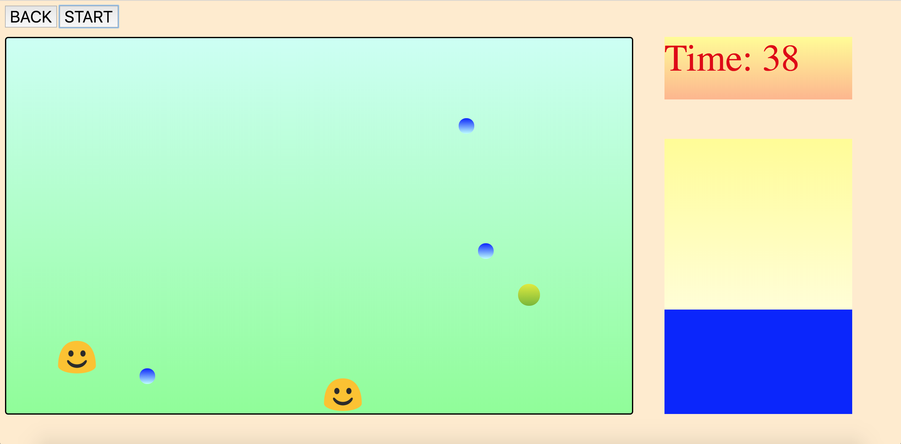
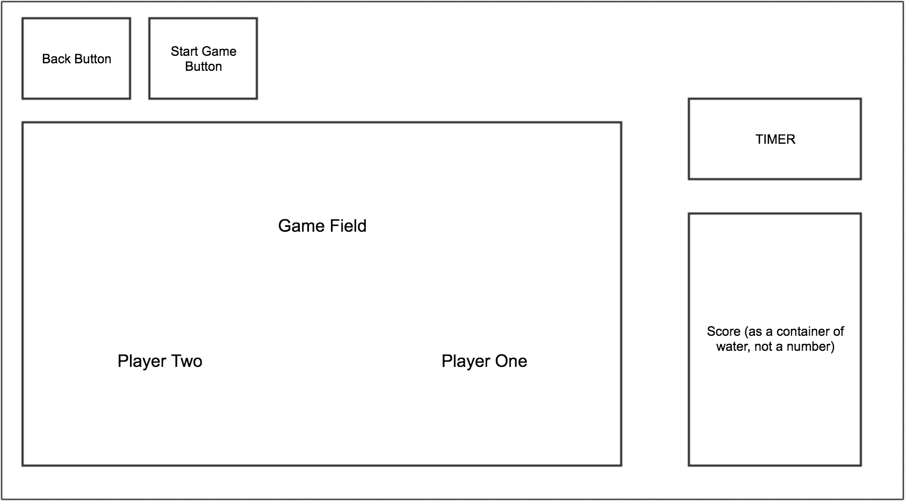

# CleanPlanet

An interactive two-player web based game. 

## Overview

This game was created using JavaScript, JQuery, HTML, and CSS.

## Instructions
<li>Work together to save the planet from toxic sludge!</li>
<li>Player 1 collects clean water (smaller blue droplets), using the Left and Right arrow keys.</li>
<li>Player 2 collects toxic sludge (larger yellow droplets), using the "Z" and "C" keys.</li>
<li>If Player 2 misses any toxic sludge, score will be reduced.</li>
<li>If Player 1 collects any toxic sludge, score will be reduced.</li>
<li>If Player 1 misses any clean water, score will be reduced.</li>
<li>Fill the container up with clean water to win!!</li>

### Original Wireframe

### Backlog

The biggest issue that I had with creating this game was getting both of the players to be able to move simultaneously without any hiccups.  After learning more about the keyup and keydown events I was able to rewrite some code to fix this issue.  

As I continue to work on this game, I would like to add varying difficulty, and possibly even new levels!

## Deployment

You can access the game [here](https://arowland900.github.io/first-game/)!

## Built With

* JavaScript
* JQuery
* HTML
* CSS
